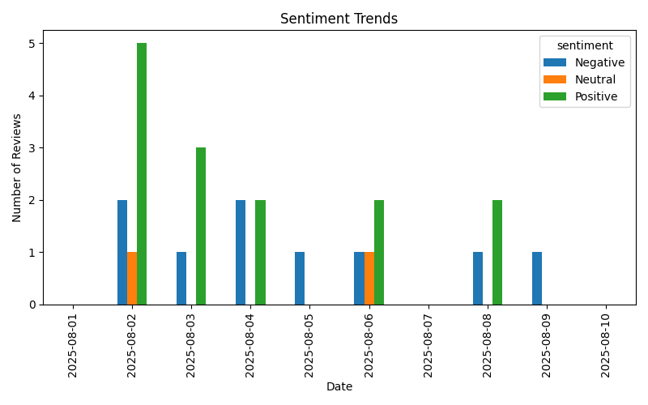
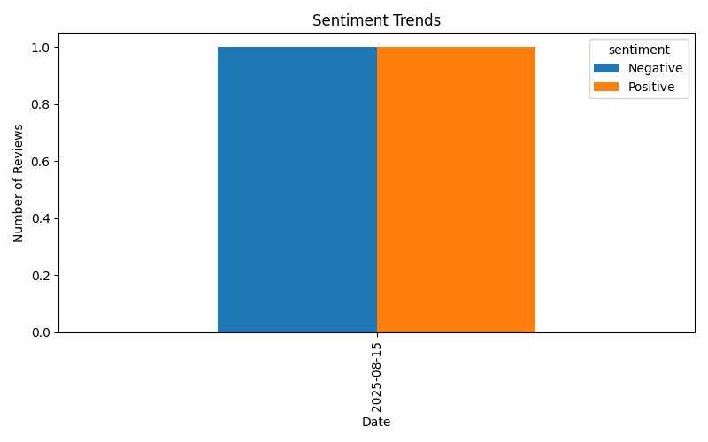

<h1 align="center">🍜  Automated Restaurant Feedback Agent – SteamNoodles 🍜</h1>
<h3 align="center">by Fathima Amana | University of Moratuwa</h3>

<p align="center">
  
  
  
  
</p>

## 📑 Table of Contents
1. [Project Overview](#-project-overview)  
2. [Features](#-features)  
3. [Tools & Technologies](#-tools--technologies)  
4. [Setup & Usage](#️-setup--usage)
5. [Output Examples](#-output-examples)

---

## 🚀 Project Overview
SteamNoodles is a modern restaurant chain that gathers customer feedback about food, service, and ambiance. This project implements an **AI-powered multi-agent system** to automate feedback processing and sentiment analysis.  

**Agents included:**

- **Feedback Response Agent:**  
  Detects the sentiment of customer reviews (Positive, Negative, Neutral) using an LLM and generates short, polite, professional replies automatically.  

- **Sentiment Visualization Agent:**  
  Creates plots showing sentiment trends over any specified date range, supporting inputs like `"today"`, `"yesterday"`, `"last 7 days"`, or `"YYYY-MM-DD to YYYY-MM-DD"`.  

The system leverages **LangChain + ChatGroq (Llama3-70B)** with Python libraries such as `pandas`, `matplotlib`, `seaborn`, and `dateparser`.

---

## ✨ Features
- **AI-powered sentiment detection** for customer reviews.  
- **Automated, context-aware replies** to feedback.  
- **Flexible date-based filtering** with natural language inputs.  
- **Interactive and exportable plots** via matplotlib and seaborn.  
- **CSV-based data source** for easy integration and updates.  

---

## 🛠 Tools & Technologies
| Component        | Description |
|----------------- |-------------|
| **LangChain**    | Framework for building LLM-powered apps |
| **ChatGroq**     | LLM provider (Llama3-70B) |
| **pandas**       | Data manipulation |
| **matplotlib**   | Data visualization |
| **seaborn**      | Statistical plotting |
| **dateparser**   | Natural language date parsing |
| **python-dotenv**| Environment variable management |

---

## ⚙️ Setup & Usage

### 1️⃣ Install Dependencies
```bash
git clone https://github.com/yourusername/steamnoodles-feedback-agent.git
cd steamnoodles-feedback-agent
pip install -r requirements.txt
```

### 2️⃣ Configuration
Create a .env file in the root directory:
```bash
GROQ_API_KEY=your_api_key_here
```
### 3️⃣ Usage
Place your dataset in: data/reviews.csv
(must include date, review, and sentiment columns).
Run the main program:
```bash
python main.py
```
Sentiment plots will be saved in outputs as sentimentpng1, sentimentpng2, ect.

---

## 📊 Output Examples
```python

if __name__ == "__main__":
    print("Example 1: Detect Sentiment")
    print(agent.run("Detect sentiment for: The noodles were delicious and the staff was friendly."))

    #negative feedback
    print("\nExample 2: Generate Reply")
    feedback = "The service was very slow yesterday."
    reply = generate_reply(feedback)
    print(f"Feedback: {feedback}")
    print(f"Reply: {reply}")

    #positive feedback
    print("\nExample 2: Generate Reply")
    feedback = "The foods are mouth watering."
    reply = generate_reply(feedback)
    print(f"Feedback: {feedback}")
    print(f"Reply: {reply}")

    print("\nExample 3: Generate Sentiment Plot")
    plot_path = plotter("2025-08-01 , 2025-08-10")
    print(f"Plot saved as: {plot_path}")

    print("\nExample 3: Generate Sentiment Plot")
    plot_path = plotter("Today")
    print(f"Plot saved as: {plot_path}")    
```

```bash
PS D:\SEM 3\AgentX-leo\project> python main.py
Example 1: Detect Sentiment
D:\SEM 3\AgentX-leo\project\main.py:191: LangChainDeprecationWarning: The method `Chain.run` was deprecated in langchain 0.1.0 and will be removed in 1.0. Use :meth:`~invoke` instead.
  print(agent.run("Detect sentiment for: The noodles were delicious and the staff was friendly."))

> Entering new AgentExecutor chain...
Thought: I need to detect the sentiment of the given customer feedback.

Action: SentimentDetector
Action Input: The noodles were delicious and the staff was friendly.
Observation: Positive
Thought:I now know the sentiment of the customer feedback.

Final Answer: The sentiment of the customer feedback is Positive.

> Finished chain.
The sentiment of the customer feedback is Positive.

Example 2: Generate Reply
Feedback: The service was very slow yesterday.
Reply: Here is a short, polite, and professional response:

"Dear valued customer,

Thank you for taking the time to share your feedback with us. We apologize for the slow service you experienced yesterday. We understand the importance of prompt service and are truly sorry that we fell short of our standards. We will take immediate action to address this issue and ensure that our service meets your expectations in the future.
Thank you for your patience and understanding. If you have any further concerns, please don't hesitate to reach out to us.

Best regards, [Your Name]"

Example 2: Generate Reply
Feedback: The foods are mouth watering.
Reply: Here is a possible response:

"Thank you so much for taking the time to share your kind words about our food! We're thrilled to hear that you enjoyed your dining experience with us. We strive to serve delicious and satisfying meals, and it's great to know that we've been able to do just that for you. We appreciate your feedback and look forward to serving you again soon!"

Example 3: Generate Sentiment Plot
Plot saved as: sentimentplot1.png

Example 3: Generate Sentiment Plot
Plot saved as: sentimentplot2.png

```
### Sentiment Trend Plot



